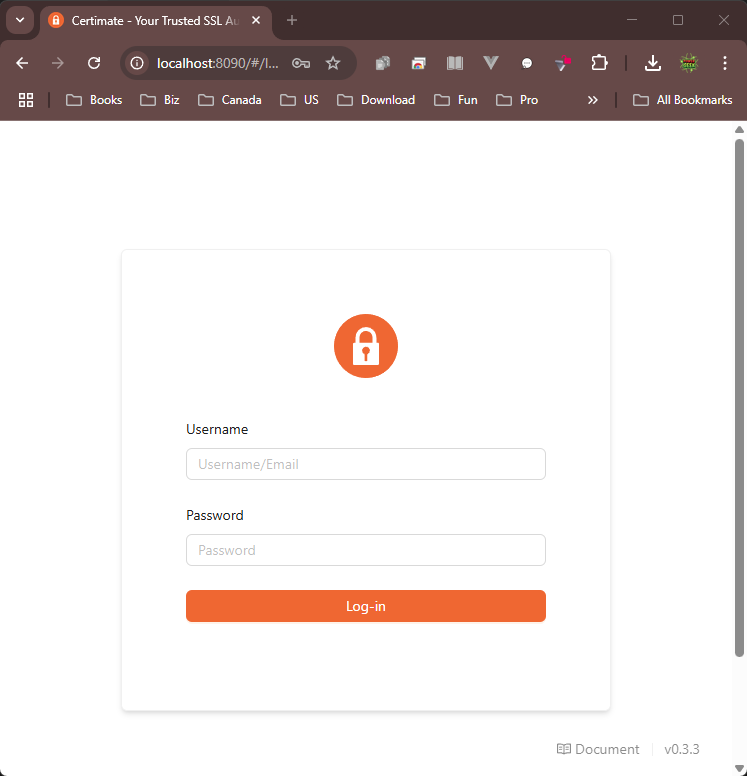

<h1 align="center">🔒 Certimate</h1>

[中文](README_ZH.md) ｜ English | https://github.com/usual2970/certimate

---


## 🚩 Introduction

For individuals managing personal projects or those responsible for IT operations in small businesses who need to manage multiple domain names, applying for certificates manually comes with several drawbacks:

- 😱 Troublesome: Applying for and deploying certificates isn’t difficult, but it can be quite a hassle, especially when managing multiple domains.
- 😭 Easily forgotten: The current free certificate has a validity period of only 90 days, requiring regular renewal operations. This increases the workload and makes it easy to forget, which can result in the website becoming inaccessible.

Certimate was created to solve the above-mentioned issues and has the following advantages:

- **Local Deployment**: Simply to install, download the binary and run it directly. Supports Docker deployment and source code deployment for added flexibility.
- **Data Security**: With private deployment, all data is stored on your own servers, ensuring it never resides on third-party systems and maintaining full control over your data.
- **Easy Operation**: Effortlessly apply and deploy SSL certificates with minimal configuration. The system automatically renews certificates before expiration, providing a fully automated workflow, no manual intervention required.

Certimate aims to provide users with a secure and user-friendly SSL certificate management solution.


## 💡 Features

- Flexible workflow orchestration, fully automation from certificate application to deployment;
- Supports single-domain, multi-domain, wildcard certificates, with options for RSA or ECC.
- Supports various certificate formats such as PEM, PFX, JKS.
- Supports more than 20+ domain registrars (e.g., Alibaba Cloud, Tencent Cloud, Cloudflare, etc. [Check out this link](https://docs.certimate.me/en/docs/reference/providers#supported-dns-providers));
- Supports more than 60+ deployment targets (e.g., Kubernetes, CDN, WAF, load balancers, etc. [Check out this link](https://docs.certimate.me/en/docs/reference/providers#supported-host-providers));
- Supports multiple notification channels including email, DingTalk, Feishu, WeCom, Webhook, and more;
- Supports multiple ACME CAs including Let's Encrypt, ZeroSSL, Google Trust Services, and more;
- More features waiting to be discovered.


## 🚩 Tech Architecture

Certimate is designed based on modulars, programmed in Golang, including the following modules:


## ⭐ Certificate Lifecycle

Automated ACME protocol in accordance with RFC 8555:

1. Domain verification: DNS01/HTTP-01
2. Cert-signing: ECDSA/RSA key pair
3. Automated deployment: Sync'ed with Kubernetes Secret
4. Renewal Monitoring: TLS Certificate validation monitoring


## ⏱️ Fast Track

**Deploy Certimate in 5 minutes!**

Download the archived package of precompiled binary files directly from [GitHub Releases](https://github.com/usual2970/certimate/releases), extract and then execute:

```bash
./certimate serve
```

Visit `http://127.0.0.1:8090` in your browser.

Default administrator account:

- Username: `admin@certimate.fun`
- Password: `1234567890`

Work with Certimate right now. Or read other content in the documentation to learn more.


## Docker Compose

very simple,

```shell
services:
  certimate:
    container_name: certimate_box
    image: usual2970/certimate:latest
    ports:
      - 8090:8090
    volumes:
      - ./data:/var/lib/certimate
      - ./config:/etc/certimate
    environment:
      - TZ=America/Edmonton
      - VAULT_ADDR=https://vault.example.com
```

then launch a browser to http://localhost:8090



Then the Interface be like:


## 📄 Documentation

Please visit the documentation site [docs.certimate.me](https://docs.certimate.me/en/).


## 🤝 Contributing

Certimate is a free and open-source project, licensed under the [MIT License](./LICENSE.md). You can use it for anything you want, even offering it as a paid service to users.

You can support the development of Certimate in the following ways:

- **Submit Code**: If you find a bug or have new feature requests, and you have relevant experience, [you can submit code to us](CONTRIBUTING_EN.md).
- **Submit an Issue**: For feature suggestions or bugs, you can [submit an issue](https://github.com/usual2970/certimate/issues) to us.

Support for more service providers, UI enhancements, bug fixes, and documentation improvements are all welcome. We encourage everyone to contribute.


## ⛔ Disclaimer

This software is provided under the [MIT License](https://opensource.org/licenses/MIT) and distributed “as-is” without any warranty of any kind. The authors and contributors are not responsible for any damages or losses resulting from the use or inability to use this software, including but not limited to data loss, business interruption, or any other potential harm.

**No Warranties**: This software comes without any express or implied warranties, including but not limited to implied warranties of merchantability, fitness for a particular purpose, and non-infringement.

**User Responsibilities**: By using this software, you agree to take full responsibility for any outcomes resulting from its use.


## 🌐 Join the Community

- [Telegram](https://t.me/+ZXphsppxUg41YmVl)
- Wechat Group

  

## 🚀 Star History

[](https://starchart.cc/usual2970/certimate)
